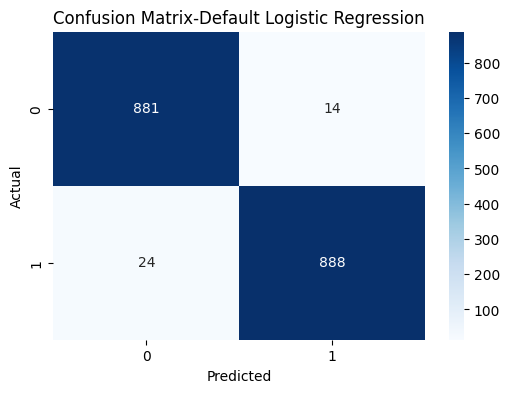

# 📧 Spam Email Classifier using NLP & Machine Learning 

A supervised machine learning project that classifies emails/SMS messages as **Spam** or **Ham** using natural language processing (NLP) and classification models.

---

## 🚀 Project Overview

This project demonstrates how machine learning can be used to **detect spam messages** using a dataset of over 5,000 messages. The pipeline includes:
- Text cleaning & tokenization
- Feature extraction using **TF-IDF**
- Handling class imbalance with **SMOTE**
- Model training using:
  - Multinomial Naive Bayes
  - Logistic Regression (with hyperparameter tuning)
- Evaluation using Accuracy, Confusion Matrix, and ROC Curve

---

## 🗂 Dataset

- ✅ Source: [SMS Spam Collection Dataset](https://www.kaggle.com/datasets/uciml/sms-spam-collection-dataset)
- ✅ Total samples: `5,157` (after cleaning)
- ✅ Classes:
  - `Ham (0)` – Not spam
  - `Spam (1)` – Unwanted message

---

## 🛠 Tech Stack

| Tool / Library     | Purpose                           |
|--------------------|------------------------------------|
| Python             | Programming Language               |
| Pandas, NumPy      | Data Processing                    |
| NLTK               | Text Preprocessing (tokenizing, stemming) |
| Scikit-learn       | Model building, evaluation         |
| Imbalanced-learn   | SMOTE for class balancing          |
| Seaborn, Matplotlib| Data Visualization                 |

---

## 📊 Exploratory Data Analysis (EDA)

- Distribution of spam vs ham messages
- Histograms of:
  - Message length
  - Word count
  - Sentence count
- Correlation heatmap

---

## 🔎 Text Preprocessing

Steps performed on each message:
- Lowercasing
- Tokenization
- Stopword and punctuation removal
- Stemming using Porter Stemmer

```python
def transform_text(text):
    text = text.lower()
    text = word_tokenize(text)
    y = [i for i in text if i.isalnum()]
    temp = [i for i in y if i not in stopwords.words('english') and i not in punctuation]
    final = [ps.stem(i) for i in temp]
    return " ".join(final)
```

---

## ✨ Feature Extraction (TF-IDF)

```python
vectorizer = TfidfVectorizer()
X = vectorizer.fit_transform(df['transform_text'])
sm = SMOTE(random_state=42)
X_resampled, y_resampled = sm.fit_resample(X, y)
```

---

## 🧠 Model Training & Tuning

### 🔹 1. Multinomial Naive Bayes

```python
model = MultinomialNB()
model.fit(X_train, y_train)
```
- Accuracy: **98.17%**

### 🔹 2. Logistic Regression (Default)

```python
default_lr = LogisticRegression(max_iter=1000)
default_lr.fit(X_train, y_train)
```
- Accuracy: **97.89%**

### 🔹 3. Logistic Regression with GridSearchCV

```python
param_grid = {
    'C': [0.01, 0.1, 1, 10],
    'solver': ['liblinear', 'lbfgs'],
    'penalty': ['l2']
}
grid = GridSearchCV(LogisticRegression(max_iter=1000), param_grid, cv=5)
grid.fit(X_train, y_train)
```

---

## 📈 Model Evaluation

### ✅ Confusion Matrix  


### ✅ ROC Curve  


---

## 🔍 Predict Your Own Message

```python
def predict_message(msg):
    cleaned = transform_text(msg)
    vec = vectorizer.transform([cleaned]).toarray()
    pred = default_lr.predict(vec)[0]
    return "Spam" if pred == 1 else "Ham"
```

---

## 📁 Project Structure

```
📦 spam-email-classifier
 ┣ 📜 Spam_Email_Classifier_Cleaned.ipynb
 ┣ 📜 README.md
 ┣ 📊 confusion_matrix.png
 ┣ 📊 roc_curve.png
 ┗ 📄 requirements.txt
```

---

## 💻 How to Run

```bash
git clone https://github.com/yourusername/spam-email-classifier.git
cd spam-email-classifier
pip install -r requirements.txt
```

---

## 🧠 Future Improvements

- ✅ Deploy as a web app using **Streamlit**
- ✅ Include more models (Random Forest, XGBoost)
- ✅ Save model and vectorizer as `.pkl` files
- ✅ Add user interface for real-time input

---

## 🙋‍♀️ Author

**Amna Nazir**  
🎓 MS Data Science | FAST University  
🔗 [LinkedIn Profile](https://www.linkedin.com/in/your-link-here)

---

## 📄 License

This project is licensed under the [MIT License](LICENSE).
